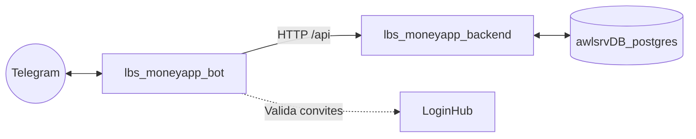

<div align="center">
  <h1>💰 MoneyAPP Bot (@awl_money_bot)</h1>
  <p>Bot de Telegram do MoneyAPP (Telegraf + TypeScript) — cliente HTTP do backend. Agora integrado nativamente no ecossistema e deploy do <b>MoneyAPP</b> principal.</p>

  <a href="https://t.me/awl_money_bot"><b>🔗 Acessar: @awl_money_bot</b></a>

  <p>
    <a href="https://skillicons.dev">
      
    </a>
  </p>
</div>

<br/>

## 🏗️ Arquitetura

O bot atua como um **cliente HTTP** do backend — ele não acessa o banco de dados diretamente. Toda
leitura e escrita passa pela API interna (`moneyapp_backend:3000/api`) através da rede Docker externa
`awl_network`. A identidade dos usuários é gerida via **LoginHub** e o
bot comunica-se com o backend do MoneyAPP de forma autenticada usando a `BOT_SERVICE_KEY`.



### 📦 Integração com o Monorepo

O bot foi unificado ao repositório principal do MoneyAPP e é orquestrado pelo `docker-compose.yml` da raiz do projeto (como serviço `lbs_moneyapp_bot`). Ele foi ajustado para compilar e subir em sincronia com o Frontend e Backend, mantendo as configurações centralizadas.

## 👥 Convites e Gestão de Acessos

O bot suporta a criação e gestão de convites.
Usuários administradores podem acessar o menu **"👥 Convidar Pessoas"** no bot, inserir o e-mail do convidado e receber imediatamente a senha temporária gerada e o link de convite. Isso aciona o endpoint `/bot/invite` do backend, dispensando a necessidade de gerenciar usuários manualmente no arquivo `.env`.

> ⚠️ O usuário convidado precisará obrigatoriamente realizar o seu primeiro login no **Painel Web do MoneyAPP** (para alterar a senha temporária) antes de conseguir interagir com o bot.

## 🤖 Inteligência Artificial (Voz e Visão)

O bot conta com integrações avançadas de Inteligência Artificial (IA) local e em nuvem para criar transações de forma mágica:

1. **Voz para Transação**:
   Grave e envie um áudio (ex: *"Gastei 50 reais de pão na padaria usando o cartão nubank"*). O bot fará:
   - **Transcrição (STT)**: Usando o modelo Whisper (via Groq API) para altíssima velocidade.
   - **Entendimento (NLU)**: Usando LLM local (Ollama) para extrair estruturadamente: valor, descrição, categoria e conta.

2. **OCR Inteligente de Comprovantes**:
   Envie a foto de um recibo ou comprovante de compra. O bot usa reconhecimento visual multimodal com LLM local (Ollama - visão) para ler a nota, extrair os valores/itens e preencher os dados da transação sem você digitar nada.

## ⚙️ Variáveis de Ambiente

As configurações do bot são lidas do arquivo `.env` principal localizado na raiz do monorepo.
Variáveis exclusivas do bot:
- **Core**: `TELEGRAM_BOT_TOKEN`, `BOT_SERVICE_KEY`
- **Ollama (IA Local)**: `OLLAMA_URL`, `OLLAMA_MODEL` (para visão), `OLLAMA_TEXT_MODEL` (para processamento de texto)
- **Groq**: `GROQ_API_KEY`

As **notificações de vencimento** são enviadas de forma proativa **apenas via Telegram** (diariamente às 08:00), alertando o usuário sobre lançamentos que vencem no **próprio dia** ou em **exatos 7 dias**.

## 🚀 Deploy e Execução

Como o bot está integrado ao `docker-compose.yml` principal, ele sobre automaticamente com o projeto:

```bash
# Na raiz do repositório MoneyAPP
docker compose --env-file .env up -d --build
```

Caso queira reconstruir ou reiniciar apenas o bot:
```bash
docker compose --env-file .env up -d --build lbs_moneyapp_bot
```

> ⚠️ **Atenção**: Apenas **uma instância** pode fazer *long-polling* usando o mesmo `TELEGRAM_BOT_TOKEN` simultaneamente. Múltiplas instâncias rodando com o mesmo token gerarão conflitos (HTTP 409) na API do Telegram.
